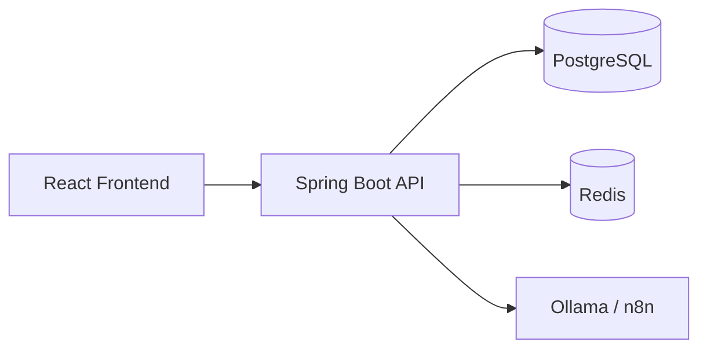

# Task Management

## Introduction
Task Management is a full-stack web application that helps users manage tasks, track expenses, and build more efficient workflows. The project combines a Spring Boot backend, a React/Vite frontend, and infrastructure services such as PostgreSQL, Redis, Docker Compose, along with automation tools like n8n and Ollama.

## Tech Stack
### Backend
- Java 21
- Spring Boot 3.4.13
- Spring Web / Spring MVC
- Spring Security + JWT
- Spring Data JPA
- PostgreSQL
- Redis
- Validation, Lombok, MapStruct
- Spring AI / Ollama (optional)

### Frontend
- React 18
- Vite 5
- React Router DOM
- Axios
- Recharts
- React Query
- React Hook Form
- date-fns

### DevOps / Infrastructure
- Docker Compose
- PostgreSQL container
- Redis container

## Current Architecture
The application is designed with a simple client-server architecture, with the following main components:



- Frontend: provides the user interface and calls the backend API.
- Backend: handles business logic, authentication, authorization, and data management.
- Database: stores information about users, tasks, and expenses.
- Cache: improves query performance and manages tokens/sessions.
- AI/Automation: enables future integration with chatbots, workflows, and smart suggestions.

## Features
- User registration, login, and token refresh using JWT.
- Task management: create, view, update, and delete tasks.
- Role-based access control for regular users and admins.
- Expense management through a separate module.
- Redis integration for better performance and caching.
- Extensible support for AI and automation with Ollama / n8n.

## API
The main backend endpoints are:

### Authentication
- POST /api/auth/login
- POST /api/auth/register
- POST /api/auth/refresh

### Tasks
- GET /api/tasks
- GET /api/tasks/me
- GET /api/tasks/{id}
- POST /api/tasks
- PATCH /api/tasks/{id}
- DELETE /api/tasks/{id}

### Expenses
- Expense API is currently being developed and expanded.

## Getting Started
### Prerequisites
- JDK 21+
- Node.js 18+
- Docker Desktop

### 1. Start infrastructure services
```bash
docker compose up -d
```

### 2. Run the backend
```bash
cd backend
./mvnw spring-boot:run
```

### 3. Run the frontend
```bash
cd frontend
npm install
npm run dev
```

### 4. Access the application
- Frontend: http://localhost:5173
- Backend API: http://localhost:8080

## Configuration
Main configuration values can be edited in backend/src/main/resources/application.properties:

- SERVER_PORT
- SPRING_DATASOURCE_URL
- SPRING_DATASOURCE_USERNAME
- SPRING_DATASOURCE_PASSWORD
- SPRING_REDIS_HOST / SPRING_REDIS_PORT
- JWT secret and expiration

By default, the app uses:
- PostgreSQL at localhost:5432
- Redis at localhost:6379
- A default admin account is created during startup

## What I learn
- TBD

## Screenshot
- TBD

## License
This project is distributed under the MIT License. See [LICENSE](LICENSE) for details.
